### 前言

你真的了解ES6吗？

#### 目录

**1、ES6 简介**

​	1.1、ECMAScript 和 JavaScript 的关系

​	1.2、ES6 与 ECMAScript 2015 的关系

​	1.4、语法提案的批准流程

​	1.5、ECMAScript 的历史

**2、Babel转码器**

​	2.1、为什么用使用Babel转码器

​	2.2、配置文件babel.config.json

​	2.3、命令行转码

​	2.4、babel-node

​	2.5、babel-register

​	2.6、浏览器环境

### 开始

#### 1、ES6 简介

##### 1.1、ECMAScript 和 JavaScript 的关系

一个常见的问题是，ECMAScript 和 JavaScript 到底是什么关系？

要讲清楚这个问题，需要回顾历史。1996 年 11 月，JavaScript 的创造者 Netscape 公司，决定将 JavaScript 提交给标准化组织 ECMA，希望这种语言能够成为国际标准。次年，ECMA 发布 262 号标准文件（ECMA-262）的第一版，规定了浏览器脚本语言的标准，并将这种语言称为 ECMAScript，这个版本就是 1.0 版。

该标准从一开始就是针对 JavaScript 语言制定的，但是之所以不叫 JavaScript，有两个原因。一是商标，Java 是 Sun 公司的商标，根据授权协议，只有 Netscape 公司可以合法地使用 JavaScript 这个名字，且 JavaScript 本身也已经被 Netscape 公司注册为商标。二是想体现这门语言的制定者是 ECMA，不是 Netscape，这样有利于保证这门语言的开放性和中立性。

因此，ECMAScript 和 JavaScript 的关系是，前者是后者的规格，后者是前者的一种实现（另外的 ECMAScript 方言还有 JScript 和 ActionScript）。日常场合，这两个词是可以互换的。

##### 1.2、ES6 与 ECMAScript 2015 的关系

ECMAScript 2015（简称 ES2015）这个词，也是经常可以看到的。它与 ES6 是什么关系呢？

2011 年，ECMAScript 5.1 版发布后，就开始制定 6.0 版了。因此，ES6 这个词的原意，就是指 JavaScript 语言的下一个版本。

但是，因为这个版本引入的语法功能太多，而且制定过程当中，还有很多组织和个人不断提交新功能。事情很快就变得清楚了，不可能在一个版本里面包括所有将要引入的功能。常规的做法是先发布 6.0 版，过一段时间再发 6.1 版，然后是 6.2 版、6.3 版等等。

但是，标准的制定者不想这样做。他们想让标准的升级成为常规流程：任何人在任何时候，都可以向标准委员会提交新语法的提案，然后标准委员会每个月开一次会，评估这些提案是否可以接受，需要哪些改进。如果经过多次会议以后，一个提案足够成熟了，就可以正式进入标准了。这就是说，标准的版本升级成为了一个不断滚动的流程，每个月都会有变动。

标准委员会最终决定，标准在每年的 6 月份正式发布一次，作为当年的正式版本。接下来的时间，就在这个版本的基础上做改动，直到下一年的 6 月份，草案就自然变成了新一年的版本。这样一来，就不需要以前的版本号了，只要用年份标记就可以了。

ES6 的第一个版本，就这样在 2015 年 6 月发布了，正式名称就是《ECMAScript 2015 标准》（简称 ES2015）。2016 年 6 月，小幅修订的《ECMAScript 2016 标准》（简称 ES2016）如期发布，这个版本可以看作是 ES6.1 版，因为两者的差异非常小（只新增了数组实例的`includes`方法和指数运算符），基本上是同一个标准。根据计划，2017 年 6 月发布 ES2017 标准。

因此，ES6 既是一个历史名词，也是一个泛指，含义是 5.1 版以后的 JavaScript 的下一代标准，涵盖了 ES2015、ES2016、ES2017 等等，而 ES2015 则是正式名称，特指该年发布的正式版本的语言标准。本书中提到 ES6 的地方，一般是指 ES2015 标准，但有时也是泛指“下一代 JavaScript 语言”。

##### 1.4、语法提案的批准流程

任何人都可以向标准委员会（又称 TC39 委员会）提案，要求修改语言标准。

一种新的语法从提案到变成正式标准，需要经历五个阶段。每个阶段的变动都需要由 TC39 委员会批准。

- Stage 0 - Strawman（展示阶段）
- Stage 1 - Proposal（征求意见阶段）
- Stage 2 - Draft（草案阶段）
- Stage 3 - Candidate（候选人阶段）
- Stage 4 - Finished（定案阶段）

一个提案只要能进入 Stage 2，就差不多肯定会包括在以后的正式标准里面。ECMAScript 当前的所有提案，可以在 TC39 的官方网站[GitHub.com/tc39/ecma262](https://github.com/tc39/ecma262)查看。

本书的写作目标之一，是跟踪 ECMAScript 语言的最新进展，介绍 5.1 版本以后所有的新语法。对于那些明确或很有希望，将要列入标准的新语法，都将予以介绍。

##### 1.5、ECMAScript 的历史

ES6 从开始制定到最后发布，整整用了 15 年。

前面提到，ECMAScript 1.0 是 1997 年发布的，接下来的两年，连续发布了 ECMAScript 2.0（1998 年 6 月）和 ECMAScript 3.0（1999 年 12 月）。3.0 版是一个巨大的成功，在业界得到广泛支持，成为通行标准，奠定了 JavaScript 语言的基本语法，以后的版本完全继承。直到今天，初学者一开始学习 JavaScript，其实就是在学 3.0 版的语法。

2000 年，ECMAScript 4.0 开始酝酿。这个版本最后没有通过，但是它的大部分内容被 ES6 继承了。因此，ES6 制定的起点其实是 2000 年。

为什么 ES4 没有通过呢？因为这个版本太激进了，对 ES3 做了彻底升级，导致标准委员会的一些成员不愿意接受。ECMA 的第 39 号技术专家委员会（Technical Committee 39，简称 TC39）负责制订 ECMAScript 标准，成员包括 Microsoft、Mozilla、Google 等大公司。

2007 年 10 月，ECMAScript 4.0 版草案发布，本来预计次年 8 月发布正式版本。但是，各方对于是否通过这个标准，发生了严重分歧。以 Yahoo、Microsoft、Google 为首的大公司，反对 JavaScript 的大幅升级，主张小幅改动；以 JavaScript 创造者 Brendan Eich 为首的 Mozilla 公司，则坚持当前的草案。

2008 年 7 月，由于对于下一个版本应该包括哪些功能，各方分歧太大，争论过于激烈，ECMA 开会决定，中止 ECMAScript 4.0 的开发，将其中涉及现有功能改善的一小部分，发布为 ECMAScript 3.1，而将其他激进的设想扩大范围，放入以后的版本，由于会议的气氛，该版本的项目代号起名为 Harmony（和谐）。会后不久，ECMAScript 3.1 就改名为 ECMAScript 5。

2009 年 12 月，ECMAScript 5.0 版正式发布。Harmony 项目则一分为二，一些较为可行的设想定名为 JavaScript.next 继续开发，后来演变成 ECMAScript 6；一些不是很成熟的设想，则被视为 JavaScript.next.next，在更远的将来再考虑推出。TC39 委员会的总体考虑是，ES5 与 ES3 基本保持兼容，较大的语法修正和新功能加入，将由 JavaScript.next 完成。当时，JavaScript.next 指的是 ES6，第六版发布以后，就指 ES7。TC39 的判断是，ES5 会在 2013 年的年中成为 JavaScript 开发的主流标准，并在此后五年中一直保持这个位置。

2011 年 6 月，ECMAScript 5.1 版发布，并且成为 ISO 国际标准（ISO/IEC 16262:2011）。

2013 年 3 月，ECMAScript 6 草案冻结，不再添加新功能。新的功能设想将被放到 ECMAScript 7。

2013 年 12 月，ECMAScript 6 草案发布。然后是 12 个月的讨论期，听取各方反馈。

2015 年 6 月，ECMAScript 6 正式通过，成为国际标准。从 2000 年算起，这时已经过去了 15 年。

目前，各大浏览器对 ES6 的支持可以查看[kangax.github.io/compat-table/es6/](https://kangax.github.io/compat-table/es6/)。

Node.js 是 JavaScript 的服务器运行环境（runtime）。它对 ES6 的支持度更高。除了那些默认打开的功能，还有一些语法功能已经实现了，但是默认没有打开。使用下面的命令，可以查看 Node.js 默认没有打开的 ES6 实验性语法。

```powershell
# Linux & Mac
node --v8-options | grep harmony

# Windows
node --v8-options | findstr harmony
```

#### 2、Babel转码器

##### 2.1、为什么使用Babel转码器

[Babel](https://babeljs.io/) 是一个广泛使用的 ES6 转码器，可以将 ES6 代码转为 ES5 代码，从而在老版本的浏览器执行。这意味着，你可以用 ES6 的方式编写程序，又不用担心现有环境是否支持。下面是一个例子。

```js
// 转码前
input.map(item => item + 1);

// 转码后
input.map(function (item) {
  return item + 1;
});
```

上面的原始代码用了箭头函数，Babel 将其转为普通函数，就能在不支持箭头函数的 JavaScript 环境执行了。

下面的命令在项目目录中，安装 Babel。

```powershell
npm install --save-dev @babel/core
```


##### 2.2、配置文件babel.config.json

初始化项目

```powershell
npm init -y
```

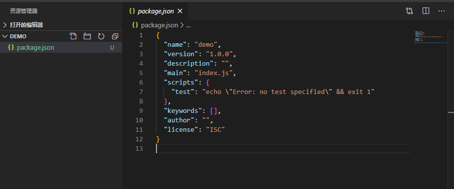


Babel 的配置文件是`.babelrc`，存放在项目的根目录下。使用 Babel 的第一步，就是配置这个文件，没有的话就在根目录新建一个。

该文件用来设置转码规则和插件，基本格式如下。

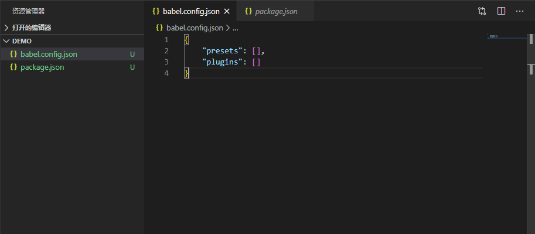

> presetes -> 转码规则
>
> plugins -> 插件

官方提供以下的规则集，你可以根据需要安装。

```powershell
#最新转码规则
npm install --save-dev @babel/preset-env

#react 转码规则
npm install --save-dev @babel/preset-react
```

安装完成以后将规则加入.babelrc。

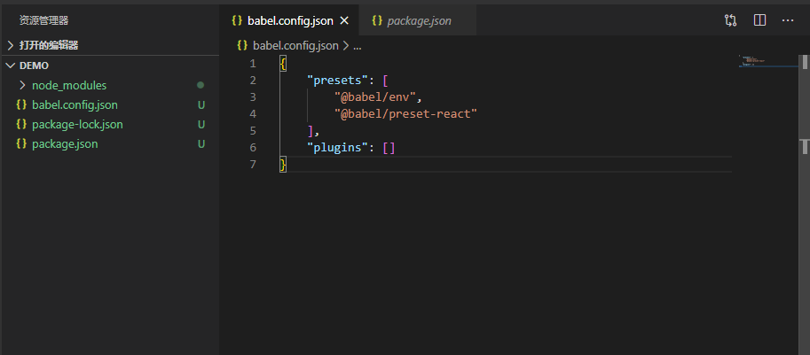

基本配置就完成了。


##### 2.3、命令行转码

命令行转码常用与写少量js代码转码。

安装命令如下

```powershell
npm install --save-dev @babel/cli
```


1. 转码结果输出到标准输出

```powershell
npx babel index.js
```

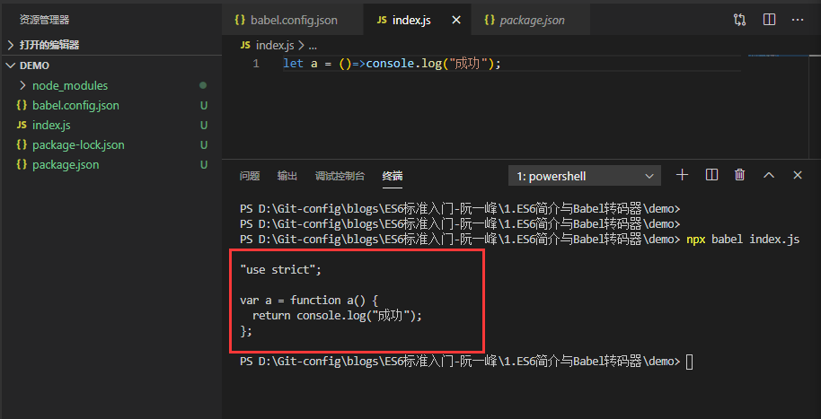


2. 转码结果输出到一个文件

> --out-file 或 -o 参数指定输出文件

```powershell
npx babel index.js --out-file output.js
#或者
npx babel index.js -o output.js
```

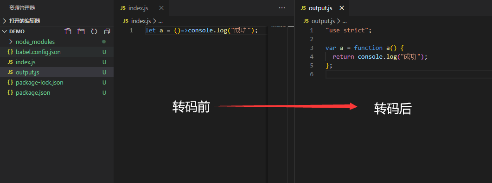


3. 整个目录转码

```powershell
npx babel src --out-dir lib
# 或者
npx babel src -d lib
```

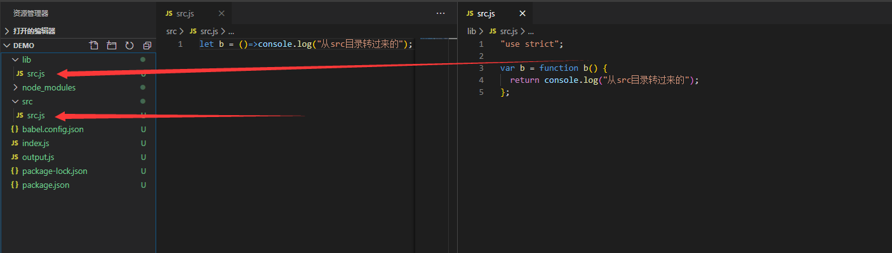


4. -s 参数生成source map文件，里面包含一些转码参数

```powershell
npx babel src -d lib -s
```

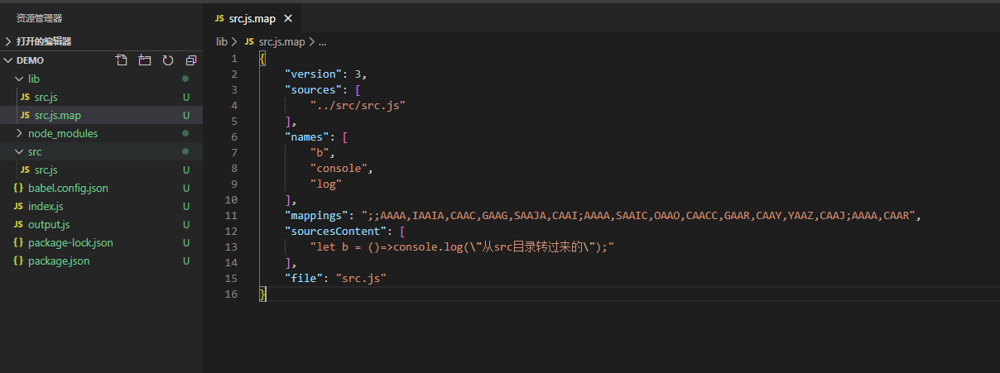


##### 2.4、babel-node

`@babel/node`模块的`babel-node`命令，提供一个支持 ES6 的 REPL 环境。它支持 Node 的 REPL 环境的所有功能，而且可以直接运行 ES6 代码。

```powershell
npm install --save-dev @babel/node
```

然后，执行`babel-node`就进入 REPL 环境。

```powershell
npx babel-node
> (x => x * 2)(1)
2
```

`babel-node`命令可以直接运行 ES6 脚本。将上面的代码放入脚本文件`index.js`，然后直接运行。

```powershell
# es6.js 的代码
# console.log((x => x * 2)(1));
npx babel-node index.js
2
```

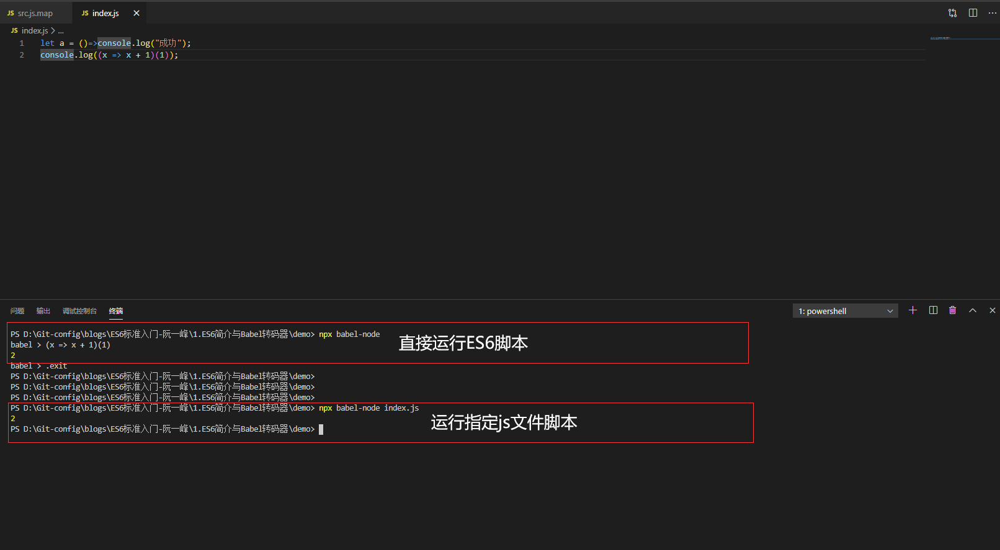


##### 2.5、babel-register

require 钩子 将自身绑定到 node 的 `require` 模块上，并在运行时进行即时编译

```powershell
npm install @babel/core @babel/register --save-dev
```

>  使用时，必须首先加载`@babel/register`。
>
> 然后，就不需要手动对`index.js`转码了。
>
> 需要注意的是，`@babel/register`只会对`require`命令加载的文件转码，而不会对当前文件转码。另外，由于它是实时转码，所以只适合在开发环境使用。

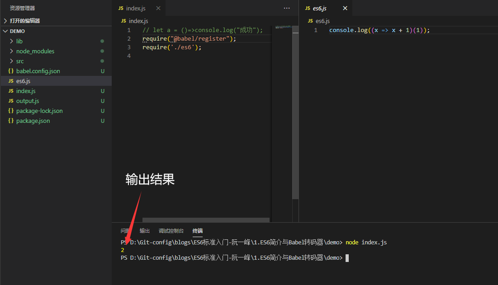


2.6、babel-polufill 垫片

我们先尝试写一个Promise对象方法，输出如下：

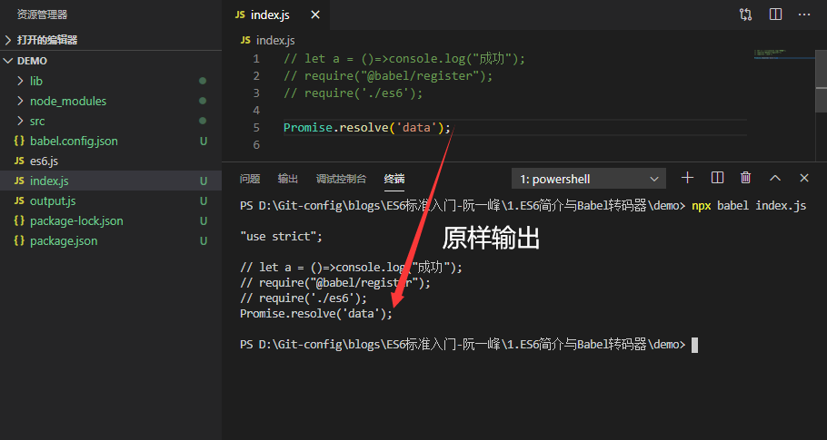

可以看到Babel 默认只转换新的 JavaScript 句法（syntax），而不转换新的 API，比如`Iterator`、`Generator`、`Set`、`Map`、`Proxy`、`Reflect`、`Symbol`、`Promise`等全局对象，以及一些定义在全局对象上的方法（比如`Object.assign`）都不会转码。

Babel 就不会转码这个方法。如果想让这个方法运行，就要为当前环境提供一个垫片

```powershell
npm install --save @babel/polyfill
```

直接运行脚本

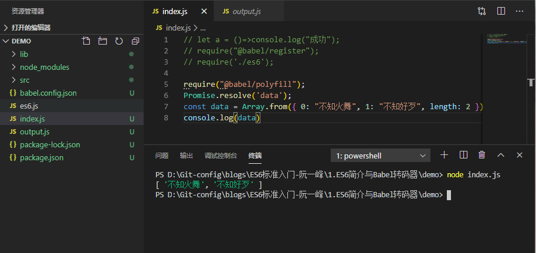

> 因为node环境集成了很多插件与依赖可以直接运行ES6文件，所以有个别东西不容易看的出来。大家明白这个道理就好。


2.6、浏览器环境

现在大多数的浏览器都支持ES6的语法操作，除非是考虑兼容内核比较低的浏览器（我当然没有在说IE啦）。一般情况不需要做太多的要求。

下面是谷歌浏览器 **Chrome**


也是支持ES6语法的。


### 总结 

ECMAScript 6简介

这一小节的重点知识就到此结束，下次小节总结`let和const命令`。

如果大家对此有任何疑问或者有不对的地方敬请留言我会对此进行修改。

喜欢就点个赞加个关注呗。

 [demo下载地址](https://gitee.com/web-liuyang/blogs/raw/master/ES6%E6%A0%87%E5%87%86%E5%85%A5%E9%97%A8-%E9%98%AE%E4%B8%80%E5%B3%B0/1.ES6%E7%AE%80%E4%BB%8B%E4%B8%8EBabel%E8%BD%AC%E7%A0%81%E5%99%A8/demo.zip) 

 [本文git地址](https://github.com/web-liuyang/blogs/blob/master/ES6%E6%A0%87%E5%87%86%E5%85%A5%E9%97%A8-%E9%98%AE%E4%B8%80%E5%B3%B0/1.ES6%E7%AE%80%E4%BB%8B%E4%B8%8EBabel%E8%BD%AC%E7%A0%81%E5%99%A8/1.ES6%E7%AE%80%E4%BB%8B%E4%B8%8EBabel%E8%BD%AC%E7%A0%81%E5%99%A8.md)  

 [本文gitee地址](https://gitee.com/web-liuyang/blogs/tree/master/ES6%E6%A0%87%E5%87%86%E5%85%A5%E9%97%A8-%E9%98%AE%E4%B8%80%E5%B3%B0/1.ES6%E7%AE%80%E4%BB%8B%E4%B8%8EBabel%E8%BD%AC%E7%A0%81%E5%99%A8)

点个star加个关注不迷路老铁

更多内容：[Git/web-liuyang](https://github.com/web-liuyang)    [Gitee/web-liuyang](https://gitee.com/web-liuyang)


